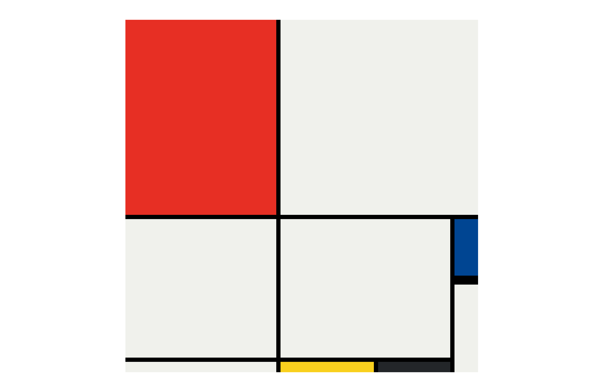

# Mondrian

## Live Demo
You can view the live version of this project [here](https://kapteynuniverse.github.io/Mondrian)

## Project Acknowledgment
This project was developed as part of the The Complete 2024 Web Development Bootcamp course taught by Angela Yu.

## Who is Mondrian?
[Piet Mondrian](https://www.britannica.com/biography/Piet-Mondrian) (born March 7, 1872, Amersfoort, Netherlands—died February 1, 1944, New York, New York, U.S.) was a painter who was an important leader in the development of modern abstract art and a major exponent of the Dutch abstract art movement known as De Stijl (“The Style”). In his mature paintings, Mondrian used the simplest combinations of straight lines, right angles, primary colours, and black, white, and gray.
